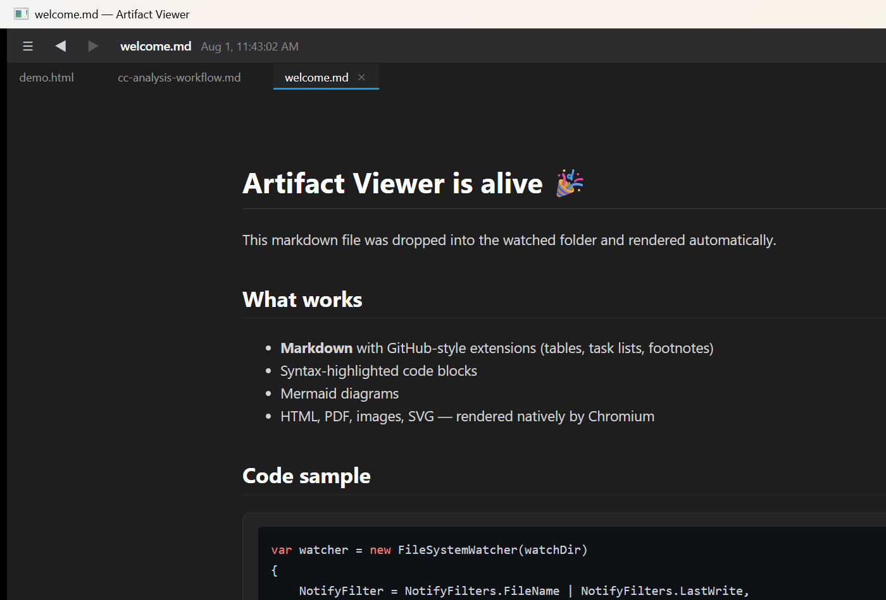
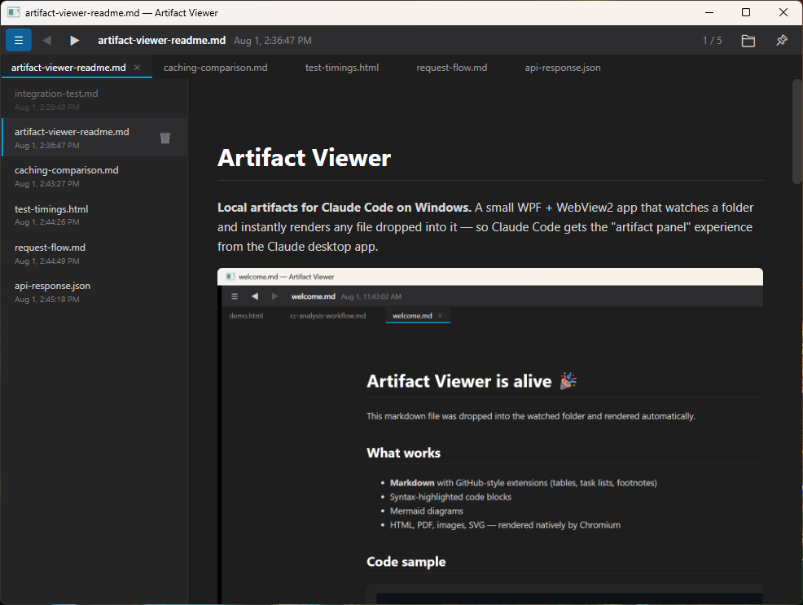
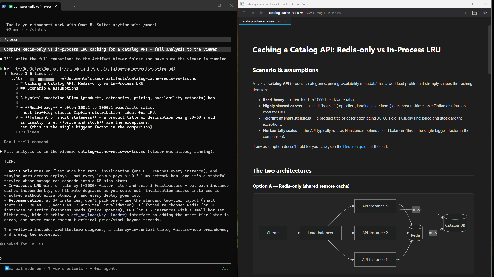
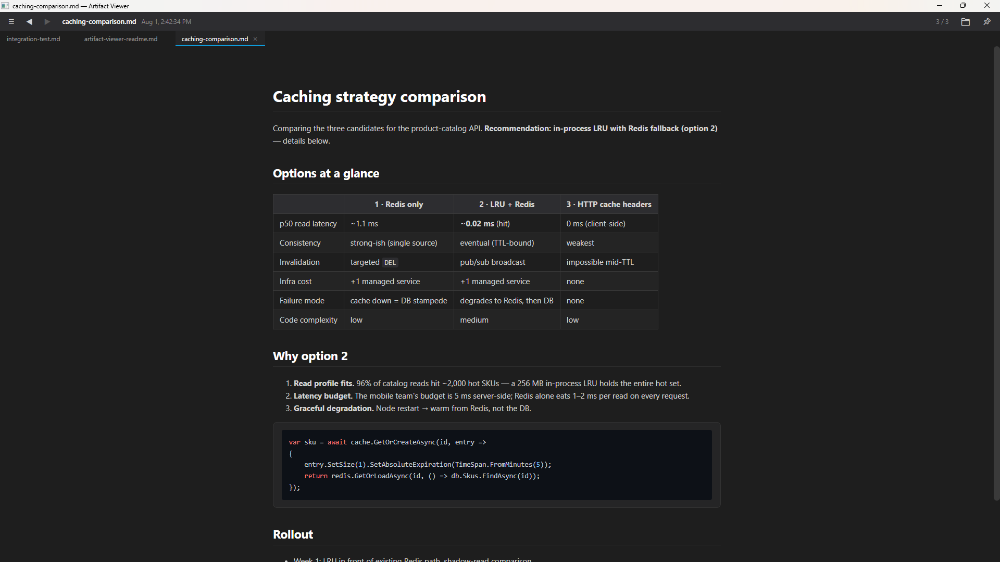
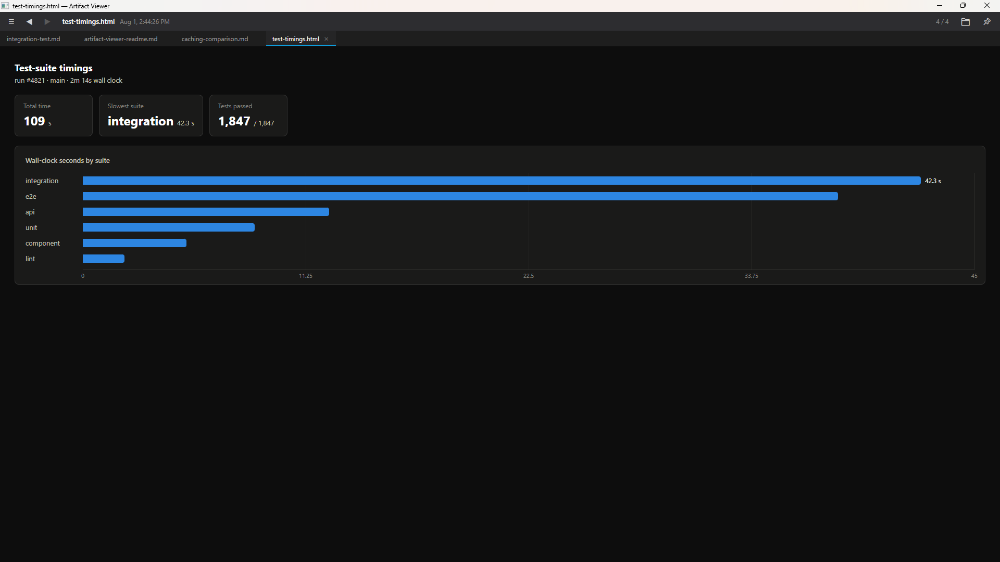
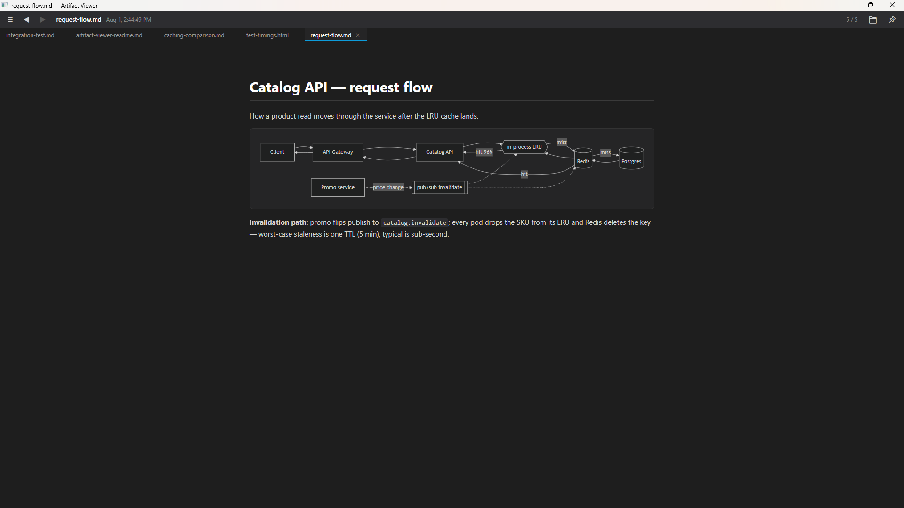
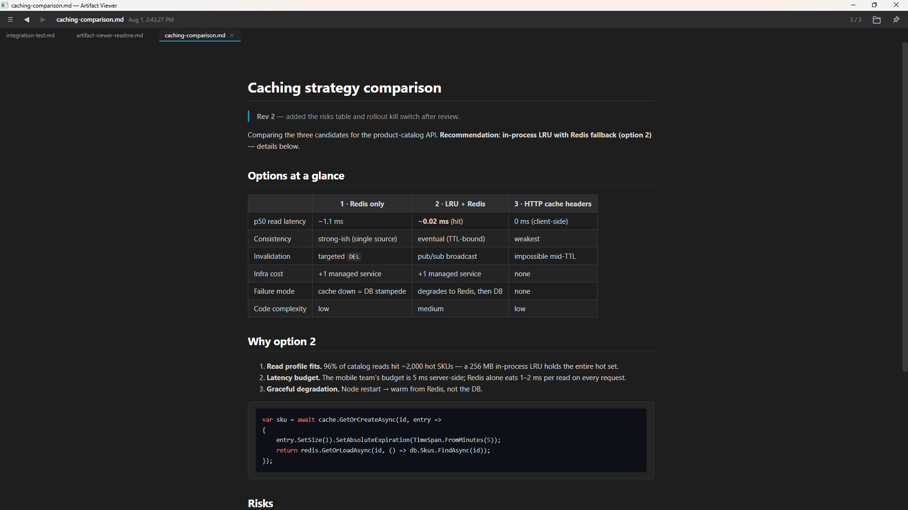
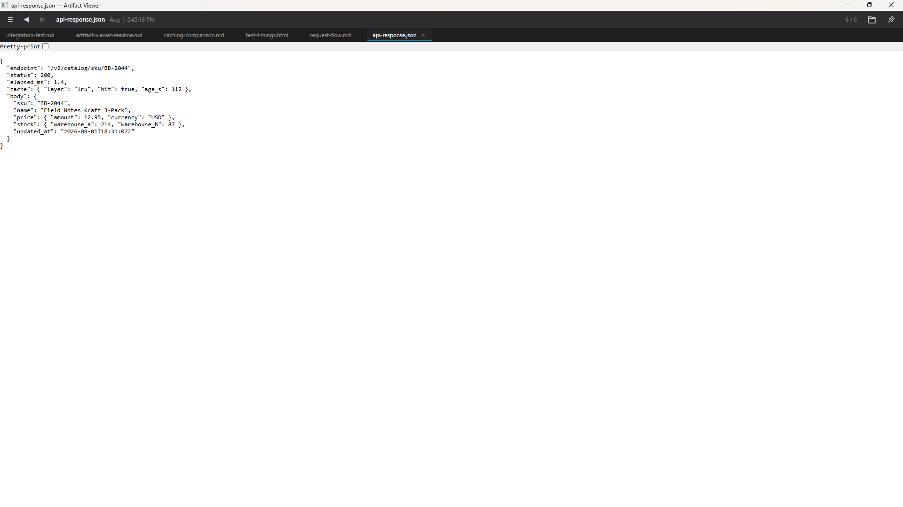

# Artifact Viewer

**Local artifacts for Claude Code on Windows.** A small WPF + WebView2 app that
watches a folder and instantly renders any file dropped into it — so Claude
Code gets the "artifact panel" experience from the Claude desktop app.



Tell Claude Code to write its outputs — reports, analyses, dashboards,
diagrams — into the watched folder and they appear in the viewer as they're
written, live-updating as Claude iterates. No more losing a great analysis
table to terminal scrollback.

## Features

- **Watches a folder** — new and changed files appear instantly (debounced,
  retries on locked files)
- **Renders** markdown (GitHub-style via Markdig, syntax-highlighted code
  blocks, ```mermaid diagrams), HTML (full Chromium, JS included), PDF, SVG,
  images, txt, json
- **Tabs** — one per file, ordered oldest → newest; hover for a ✕ that hides
  the tab without touching the file. Closed state persists across restarts;
  a closed file reopens automatically if it's rewritten.
- **◀ ▶ arrows** (also `Alt+Left` / `Alt+Right`) step through files by date;
  the title bar shows the current file, its timestamp, and position (`3 / 7`)
- **☰ sidebar** — full file list with timestamps; closed docs appear greyed
  and click to reopen; hover a row for a 🗑 that deletes the file (to the
  Recycle Bin)
- **📌 always-on-top** pin, **📁** opens the watched folder
- **Live reload** — editing the shown file re-renders it; a new file
  auto-displays only if you're already viewing the latest (browsing history
  never gets interrupted)



## Getting started

Requirements: Windows 10/11, [.NET 10 SDK](https://dotnet.microsoft.com/download)
(or Desktop Runtime to run a published build), WebView2 runtime (preinstalled
on Windows 11).

```
git clone https://github.com/claudecraft/claude-artifact-viewer
cd claude-artifact-viewer
dotnet run
```

By default it watches `Documents\claude_artifacts` (created automatically).
The watched folder is a setting: **right-click the 📁 button** to change it
(persisted in `%LOCALAPPDATA%\ArtifactViewer\settings.json`). If the configured
folder no longer exists at startup, a folder picker appears (cancel falls back
to the default). A command-line argument overrides the setting for that launch
without persisting:

```
ArtifactViewer.exe C:\some\folder
```

## Teaching Claude Code to use it

[`CLAUDE-PROMPT.md`](CLAUDE-PROMPT.md) contains a ready-to-paste section for
your `~/.claude/CLAUDE.md`. It tells Claude Code to write visual deliverables
and long analyses into the watched folder (with a short terminal summary
pointing at them) instead of dumping everything into scrollback.

## Usage examples

The pattern is always the same: you talk to Claude Code in the terminal, it
writes a file into the watched folder, and the viewer renders it instantly.
(These assume the [CLAUDE-PROMPT.md](CLAUDE-PROMPT.md) section is installed.)



**A long analysis that would drown in scrollback**

> "Compare the three caching strategies we discussed and recommend one."

Claude writes `caching-comparison.md` — full tables, trade-offs, code samples —
and the terminal gets a two-line summary plus *"full analysis in the viewer:
caching-comparison.md"*. Nothing lost to scrollback.



**An interactive dashboard**

> "Show me the test-suite timings from this run as a dashboard."

Claude writes `test-timings.html`; it opens as a new tab with a real chart —
full Chromium, so JavaScript and CDN chart libraries just work.



**Architecture diagrams**

> "Draw the request flow of this service as a diagram."

Claude writes `request-flow.md` with a ```mermaid fence — rendered as an
actual diagram, not ASCII art in the terminal.



**Iterating on one deliverable**

> "Good, but move the auth section up and add a risks table."

Claude overwrites `caching-comparison.md` and the open tab live-updates in
place. One deliverable, one tab, however many revisions.



**No Claude required**

The viewer renders anything that lands in the folder from any source — save a
PDF from your browser there, `curl -o` an API response, drop in a screenshot.
If it appears in the folder, it gets a tab.



## Implementation notes

- Non-markdown files are served through a WebView2 virtual host mapped to the
  watch folder, so Chromium renders them natively and relative asset paths work.
- Markdown is rendered to a cache file (`%LOCALAPPDATA%\ArtifactViewer\render`)
  served via a second virtual host — `NavigateToString`'s `about:blank` origin
  breaks mermaid's dynamic ESM import (ask me how I know).
- highlight.js and mermaid load from CDN, so those need internet; everything
  else works offline.
- Closed-tab state lives in `%LOCALAPPDATA%\ArtifactViewer\closed-tabs.json`.

## License

MIT — see [LICENSE](LICENSE). Not affiliated with Anthropic; "Claude" is a
product of Anthropic, this is just a companion tool built for it (with it,
actually — Claude Code wrote this app).
