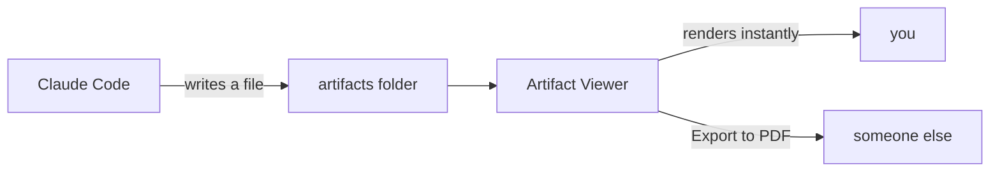

# Welcome to Artifact Viewer

**You're looking at a markdown file that was rendered the instant it appeared in
your artifacts folder.** That's the whole idea — anything written into that
folder shows up here immediately, formatted.

Delete this file whenever you like. It's written once, on first run, and won't
come back.

## Three things to know

**1. This folder is the inbox.** By default it's `Documents\claude_artifacts`.
Anything written there appears as a tab, newest on the right. Change the folder
by right-clicking the 📁 button.

**2. Teach Claude Code to use it.** Paste the block from `CLAUDE-PROMPT.md` into
`~\.claude\CLAUDE.md`, and Claude will write reports, analyses and dashboards
here instead of dumping them into terminal scrollback where they scroll away.

**3. Right-click a tab to export a PDF** — it prints what you're looking at, with
page numbers, ready to send to someone.

## What renders

| Type | Notes |
|------|-------|
| Markdown | This file. Tables, code, quotes, mermaid diagrams |
| HTML | Full Chromium — charts and interactive pages work |
| Code & logs | `.py` `.cs` `.sql` `.ts` `.ps1` and many more, highlighted |
| Data | CSV/TSV as tables, plus Word and Excel files |
| Media | PDF, images, video, audio — played or displayed natively |

Code keeps its formatting:

```python
def watch(folder):
    for change in observe(folder):
        render(change.path)   # that's the entire product
```

And ```mermaid fences become diagrams:



> Markdown, code highlighting, diagrams, images, PDFs and media all work
> **offline** — those libraries ship inside the app. Only Word and Excel
> rendering reaches out to the internet.

## Handy bits

- **Tabs** — hover for a ✕ that hides the tab without deleting the file. A hidden
  file reopens itself if something rewrites it.
- **☰** lists every file; hidden ones are greyed and click to restore.
- **📥 Keep** copies the current file somewhere durable — this folder is a
  scratchpad, Keep is the one-way valve out of it.
- **📌** keeps the window on top while you work beside it.
- **Alt+←** / **Alt+→** step through files by age.
- **Drag and drop** any supported file onto the window to view it.
